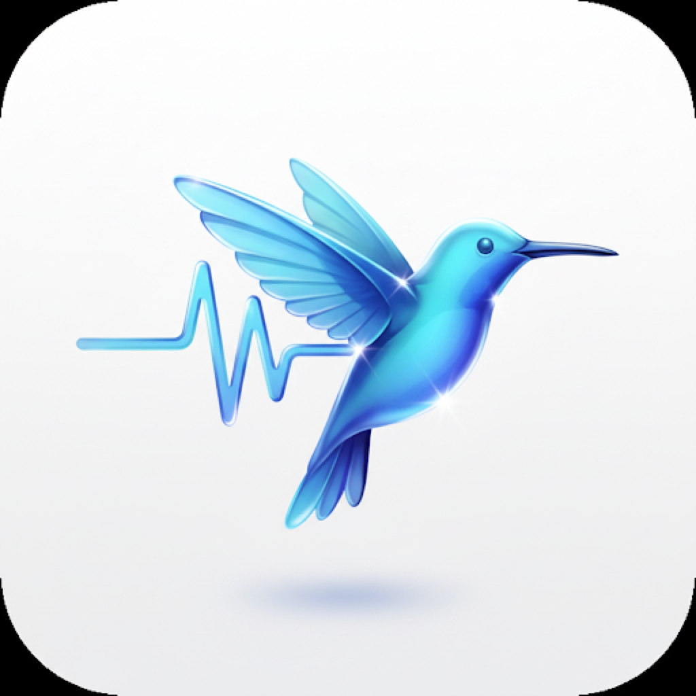
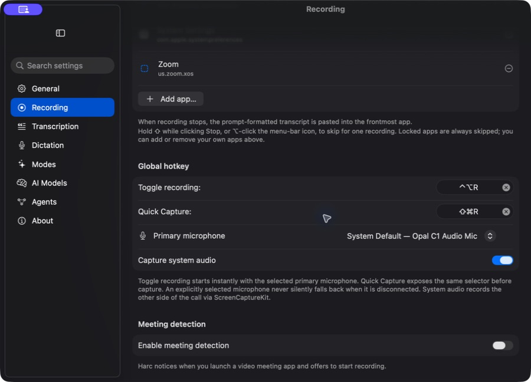
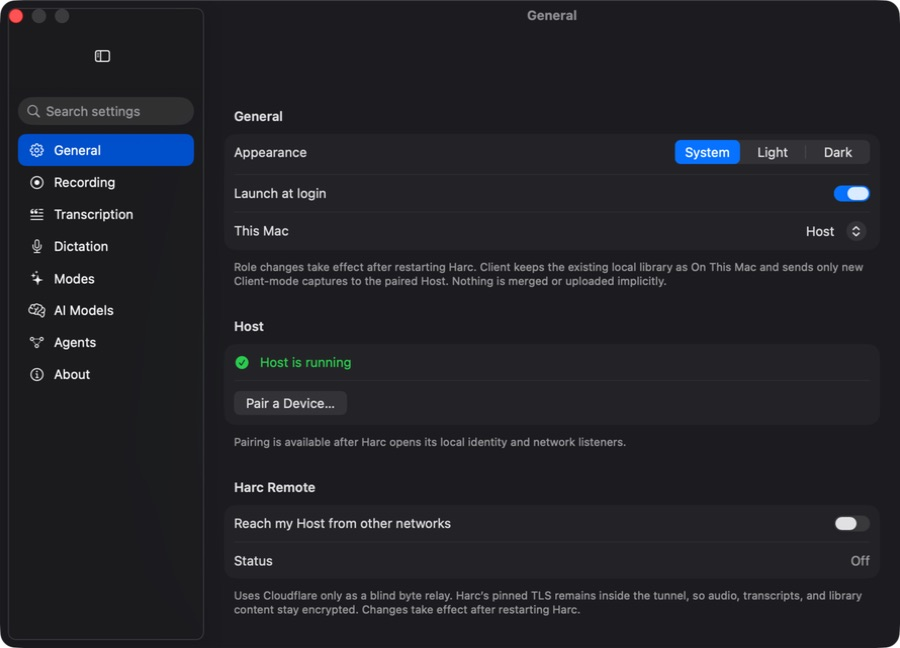
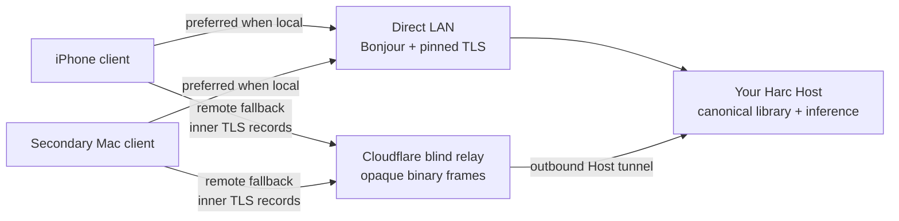

<div align="center">



# Harc

**Private meeting memory for Apple Silicon.**

Capture microphone and system audio, produce speaker-labelled transcripts,
summarize with local models, and dictate into any Mac app. Use one Mac as your
private Host when you want the same canonical library from an iPhone or another
Mac—without moving speech recognition or your library into a SaaS account.

[Download Harc 0.14.0](https://github.com/jkrack/Harc/releases/latest) ·
[See the product](#the-product) ·
[Host and clients](#one-host-your-clients) ·
[Privacy](#privacy-boundary) ·
[Install](#install)

macOS 26 or later · Apple Silicon · No account · No telemetry

</div>

---


## The product

Harc starts as a complete local Mac app. It records meetings durably, transcribes
and identifies speakers on device, makes the result searchable, and writes plain
files you own. Push-to-talk dictation uses the same warm speech engine to put text
at the cursor in any app.

When one Mac is not enough, Harc can adopt clients around a single authoritative
Host:

- a personal or always-on Mac owns the canonical library and device grants;
- a work Mac still captures and transcribes locally, then uploads losslessly in
  the background;
- an iPhone captures to a protected local master, remains usable when the Host is
  unavailable, and retries transfer from its durable outbox; and
- direct LAN is preferred, with an opt-in blind relay for different networks.

### Availability today

| Surface | Public status |
| --- | --- |
| **macOS standalone recording, Library, dictation, local AI, and MCP** | Released in Harc 0.14.0 |
| **Mac Host and secondary-Mac Client** | Available in Harc 0.14.0 with direct-LAN pairing and durable transfer |
| **HarcMobile for iPhone** | Implemented in the current source; App Store distribution is tracked separately |
| **Harc Remote** | Available in Harc 0.14.0 through `relay.adaptcontext.com`; opt-in and off until the Host owner enables it |

Harc Remote is a production feature, not a beta service. It remains opt-in so a
Host owner explicitly chooses when remote clients may use the relay.

## Capture that is designed not to lose the meeting

Start from the menu bar, the Library, or a global hotkey. Harc records the chosen
microphone and system audio together, so remote participants are included. It
writes durable audio while capture is active and processes finished chunks in
the background; transcription is usually ready when recording stops.

- Pick a primary microphone instead of trusting whichever device a dock or
  camera made the system default.
- An explicitly selected microphone never silently falls back when disconnected.
- Quick Capture exposes the same selector before recording starts.
- Auto-stop warns before ending a silent meeting, with a separate hard duration
  cap.
- Interrupted captures enter a recovery inbox rather than disappearing.
- Retroactive record can keep the previous 1–10 minutes in memory until you
  choose to save them. It is off by default.



## Transcription, speakers, and local AI

Harc runs Parakeet TDT 0.6B v3 through Core ML on Apple Silicon. Voice activity
detection skips silence; diarization produces speaker turns; and voiceprints can
associate a known person across recordings. The Host is authoritative for shared
speaker identity and can reconcile labels learned by clients.

The Library adds:

- full-text and optional hybrid semantic search;
- waveform playback and word/speaker timestamps;
- speaker naming, transcript correction, notes, tags, and pinning;
- local summaries and action items from selectable MLX model tiers; and
- re-transcription of older recordings when the speech pipeline improves.

Local model tiers are explicit downloads. Harc shows disk and memory guidance
before installation rather than silently pulling a large model.

<table>
  <tr>
    <td width="50%"></td>
    <td width="50%"></td>
  </tr>
  <tr>
    <td align="center"><sub>Local summarizer tiers with honest hardware guidance</sub></td>
    <td align="center"><sub>Built-in and custom local text transformations</sub></td>
  </tr>
</table>

## Dictate anywhere

Hold <kbd>⌃</kbd><kbd>⌥</kbd><kbd>D</kbd>, speak, and release. Harc inserts the
result at the cursor without taking focus. Push-to-talk and toggle triggers are
configurable, clipboard contents can be restored after insertion, and recent
dictations can be kept locally or disabled entirely.

Modes reshape speech before insertion—raw transcript, clean-up, email, message,
bullet list, answer, or a custom prompt. If the selected local model is not
available, Harc fails back to the raw transcript rather than dropping the text.


## One Host, your clients

The optional distributed mode has one canonical Host and multiple adopted
Mac or iPhone clients. A Mac mini is a natural Host, but it is not a protocol
requirement: a MacBook, iMac, or Mac Studio can be the authority as long as it is
available when clients need it.



### Identity and pairing

- Every installation generates a non-synchronizing P-256 device key in Keychain.
- The Host has a separate persistent authority key and grants least-privilege
  scopes to each adopted device.
- Pairing tickets expire after two minutes and never grant access by themselves.
- Both sides show the same four security words; the Host must approve the exact
  device and scopes locally.
- iPhone pairs by QR. A remote Mac can use a deliberately transferred `.harcpair`
  invitation file instead of photographing another screen.
- Revocation is Host-authoritative and invalidates both application access and
  relay admission.

The Client's existing library stays separately available as **On This Mac**.
Harc never merges, moves, or bulk-uploads it merely because the role changed.
Only new Client-mode captures enter the Host outbox.

### Direct first, blind relay second



Harc Remote solves reachability; it is not a cloud library and it does not run
inference. Both the client and Host make outbound WebSocket connections, so the
Host needs no inbound port forwarding. Inside those WebSockets, Harc keeps its
existing pinned-TLS gRPC session intact. Cloudflare relays binary TLS records
without receiving Harc application plaintext.

The relay necessarily observes network metadata—connection timing, approximate
byte counts, and opaque random routing identifiers. It does **not** receive
audio, transcripts, summaries, device names, speaker identities, library
records, or the keys needed to decrypt them. Relayed payload frames are never
written to Durable Object storage. If the relay or Host is unavailable, capture
still succeeds locally and the outbox retries later.

The public implementation and its limits are documented in the
[Host/client architecture](docs/architecture/host-client-architecture.md),
[Harc Remote architecture](docs/architecture/harc-remote-relay.md), and
[runtime pairing runbook](docs/operations/runtime-roles-and-pairing.md).

## Your data stays yours

Every standalone or canonical Host recording is projected as plain files in a
folder you choose (`~/Documents/Harc` by default):

```text
Harc/2026/2026-07-26/
  index.md          # day index, one link per meeting
  09-15-02.wav      # audio master
  09-15-02.md       # Open Knowledge Format document
  09-15-02.json     # transcript, words, timestamps, speaker segments
```

The Markdown file is an **Open Knowledge Format (OKF v0.1)** document with YAML
frontmatter followed by Summary, Action Items, Notes, and Transcript sections.
SQLite is the live indexed library; Markdown is regenerated after edits so the
portable folder remains current.

You can point Obsidian at it, search it with standard tools, put it in git, back
it up, or give a filesystem-capable agent read access. Harc does not require an
export API to release your own words.

## Agents through MCP

The app bundles `harc-mcp`, a local stdio MCP server. It holds no API keys and
opens no network listener. Agents can search and read the Library, change titles,
tags, speaker names, and summaries through Harc's store, and append stamped
notes. Transcripts are read-only to agents by design.

For Claude Code:

```sh
claude mcp add --scope user harc -- /Applications/Harc.app/Contents/MacOS/harc-mcp
```

Claude Desktop can be configured from **Settings → Agents → Add to Claude
Desktop**. For another stdio MCP client:

```json
{
  "mcpServers": {
    "harc": {
      "command": "/Applications/Harc.app/Contents/MacOS/harc-mcp"
    }
  }
}
```

In Host mode, MCP mutations route through authenticated same-user IPC to the
resident Host process so there is still one canonical writer.

## Privacy boundary


| Component | What it can access |
| --- | --- |
| **Standalone Mac** | Its local recordings, models, Library, and settings |
| **Mac/iPhone client** | Its protected local capture/outbox plus Host data allowed by its explicit grant |
| **Your Host** | The canonical Library, adopted-device registry, inference, and authorized incoming captures |
| **Cloudflare relay** | Outer connection metadata and opaque routing values; encrypted inner-TLS records only |
| **Harc project** | No account, no hosted transcript database, and no product telemetry |

- Speech-to-text, diarization, summaries, and speaker embeddings run on Harc
  devices you control.
- Models are version-pinned and checksum-verified after download.
- Auto-paste refuses password managers, the login window, and other protected
  destinations.
- Retroactive record holds a rolling buffer only in memory until you explicitly
  save it; macOS still shows the microphone privacy indicator while enabled.
- Copying or exporting a transcript into another product is your explicit action
  and outside Harc's trust boundary.

## Install

1. Download the signed, notarized DMG from
   [Releases](https://github.com/jkrack/Harc/releases/latest).
2. Drag `Harc.app` to `/Applications` and launch it.
3. Grant Microphone permission. Grant Screen Recording to capture the other side
   of a call, and Accessibility only if you want dictation inserted at the cursor.
4. Let the ~460 MB speech model finish downloading. Summarizer models are
   optional.

Updates are signed and delivered through Sparkle.

## Requirements

### Standalone Mac

| | |
| --- | --- |
| **macOS** | 26 (Tahoe) or later |
| **Chip** | Apple Silicon (arm64) |
| **Memory** | 8 GB works; 16 GB recommended for summaries |
| **Disk** | ~460 MB speech model plus 3.6–18 GB for any summarizer tier you choose |
| **Language** | English |

### Host profile

The supported starting profile is Apple Silicon, macOS 26, 16 GB unified memory,
50 GB free after model installation, and launch at login enabled. A Mac with
24 GB memory, 512 GB or larger storage, wired Ethernet, and reliable awake time
is recommended; 32 GB is preferable for concurrent clients or larger models.
These recommendations will be refined from measured production load data.

## How it works

`harc-stt` is a separate executable reached over a Unix socket, so model load is
paid once and an audio-stack failure does not have to take down the UI. Capture
writes a durable WAV before processing. Background workers transcribe completed
chunks, then commit the recording bundle atomically. GRDB/SQLite backs the live
Library and projects each edit back into OKF Markdown.

Distributed mode adds scoped device identities, signed grants and receipts,
gRPC over pinned TLS, lossless ALAC transfer, resumable outboxes, and a
Host-authoritative processing and speaker-identity policy. The blind relay wraps
that existing TLS byte stream; it does not replace the application protocol.

## Build from source

Requires Xcode with Swift 6.2 and Homebrew:

```sh
brew install xcodegen
swift test --jobs 2
xcodegen generate
xcodebuild -project Harc.xcodeproj -scheme Harc -destination 'platform=macOS' -jobs 2 build
```

`swift test` does not compile `HarcApp/`; always finish with an Xcode build.
Relay development is isolated under [`CloudflareRelay/`](CloudflareRelay/).
See [`AGENTS.md`](AGENTS.md) for architecture and validation rules.

## Uninstall

Quit Harc and delete `Harc.app`. Then remove only the data you no longer want:

```text
~/Documents/Harc                                # recordings and transcripts—keep if wanted
~/Library/Application Support/Harc              # Library, roles, outboxes, settings, local models
~/Library/Application Support/FluidAudio/Models # speech models
~/Library/Caches/Harc                           # rebuildable caches and daemon log
~/.harc                                         # local daemon sockets
```

## License

Copyright © 2026 **CloudArchitech LLC**.

Harc is source-available under
[PolyForm Noncommercial 1.0.0](https://polyformproject.org/licenses/noncommercial/1.0.0).
Personal and other noncommercial use is allowed; commercial use requires a
separate license from CloudArchitech LLC. See [`LICENSE`](LICENSE).
