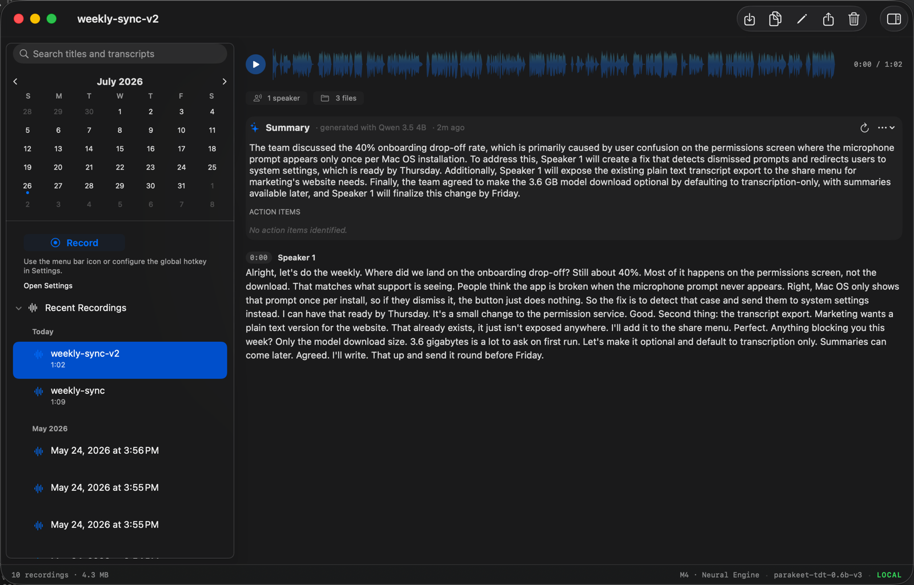
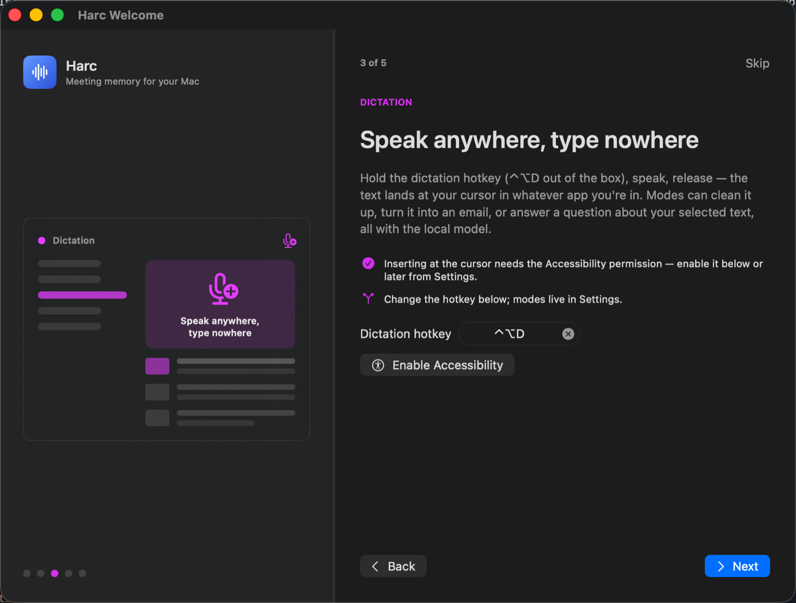
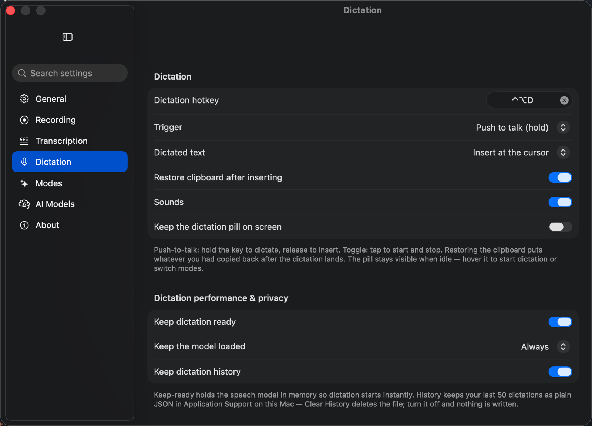
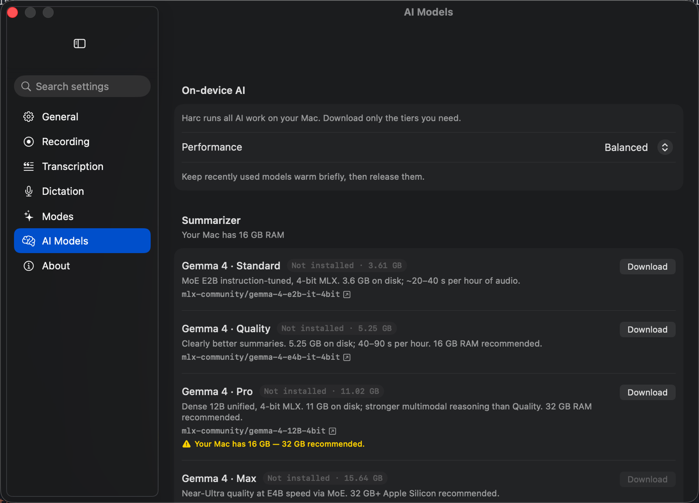
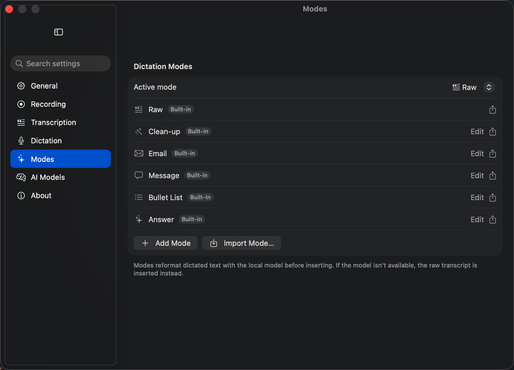
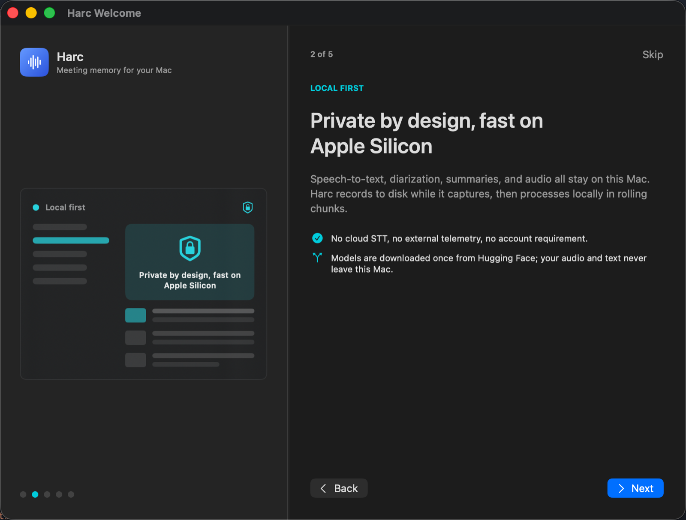
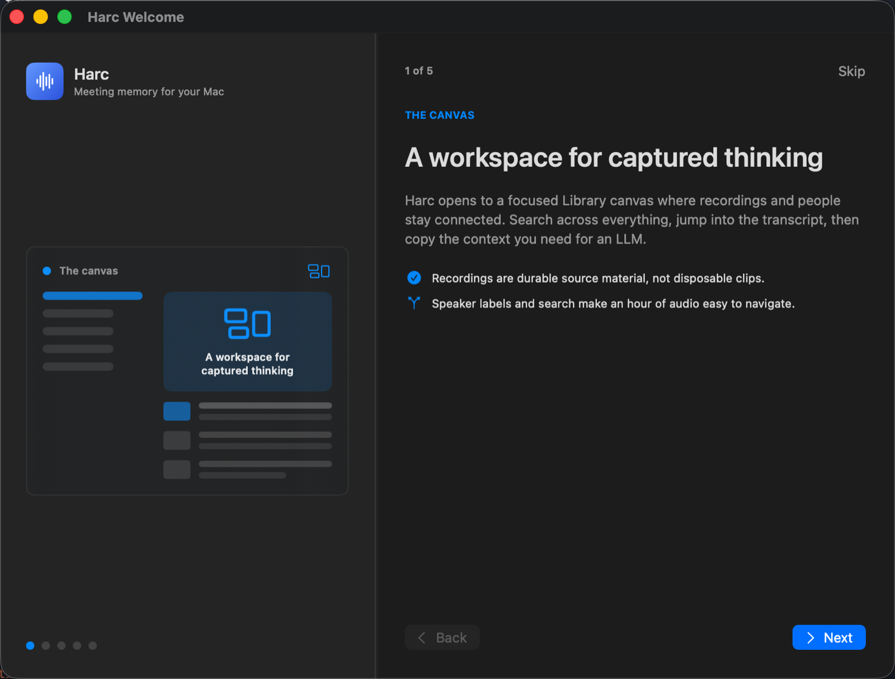

<div align="center">

# Harc

**Meeting memory for your Mac.**

Record a meeting, get a speaker-labelled transcript you can paste into an LLM.
Hold a key anywhere, speak, and the text lands at your cursor.
Everything runs on your Mac — no cloud, no account, no telemetry.

[Download](https://github.com/jkrack/Harc/releases/latest) ·
[Features](#what-it-does) ·
[Privacy](#privacy) ·
[Install](#install)

macOS 26 (Tahoe) or later · Apple Silicon · ~460 MB speech model

</div>

---



## What it does

Harc is two tools that happen to share a speech engine.

### 1. Meeting capture

Start recording from the menu bar or a hotkey. Harc captures **your microphone
and the system audio together**, so the people on the call end up in the
transcript too — not just you. Audio is written to disk as it records, and
transcription runs in the background in rolling chunks, so the transcript is
essentially finished the moment you press stop.

The design goal is not low latency. It is **never losing an hour of audio**:
the recording survives a crash, a sleep, or a power loss, and a recovery inbox
offers to rebuild anything that was interrupted.

<!-- SCREENSHOT: menu-bar panel mid-recording, showing elapsed time and levels. -->

### 2. Push-to-talk dictation

Hold ⌃⌥D, speak, release. The text is inserted at your cursor in whatever app
you were already in. A floating pill shows the waveform without stealing
focus.

Modes reshape what you said before it lands — clean up the filler, turn it
into an email, a message, a bullet list, or answer a question about the text
you have selected. All of it runs through a local model.



<!-- SCREENSHOT: the dictation HUD mid-dictation, live waveform + mode chip. -->

## Feature list

**Capture**
- Microphone **and** system audio, mixed to one recording (via ScreenCaptureKit)
- Toggle recording from the menu bar, a global hotkey (⌃⌥R by default), or the Library window
- **Retroactive record** — for the moment someone says something worth keeping and you weren't recording. Harc can hold the last 1–10 minutes in memory, so pressing record captures the conversation you already had, not just the one starting now. Off by default; see [Privacy](#privacy) for what it costs
- Auto-stop on silence, with a warning before it fires, plus a hard duration cap
- Meeting detection: notices when a video-call app launches and offers to record
- Durable WAV on disk during capture; a recovery inbox for anything interrupted

**Transcription**
- Parakeet TDT 0.6B v3 running on the Neural Engine via Core ML
- Speaker diarization on by default — `Speaker 1:` / `Speaker 2:` labels a downstream LLM can use
- Speaker re-identification links the same voice to a named person across recordings
- Voice-activity detection skips silence, which is most of a meeting's mic track
- A vocabulary list rewrites names, acronyms and jargon the model mishears
- **Re-transcribe the archive** when a better engine ships, so old recordings improve too

**Library**
- Searchable across every transcript, with optional **hybrid search** that blends meaning into keyword results
- Calendar, pinning, and date grouping in the sidebar
- Transcript editor, speaker renaming, and an inspector with file metadata
- Every recording is written as plain files you own — see [Your data stays yours](#your-data-stays-yours)

**Dictation**
- Push-to-talk or toggle, on a hotkey you choose
- Inserts at the cursor in any app, or copies to the clipboard instead
- Restores whatever you had copied once the text lands
- Keeps the speech model warm so there is no cold-load pause
- Searchable history of recent dictations, kept locally and switchable off
- Refuses to run while a meeting recording is active — mic and daemon are single-user resources



**AI, on device**
- Meeting summaries and action items from a local MLX model
- Summarizer tiers from 3.6 GB to 18 GB — download only what your Mac can run, with RAM guidance per tier
- Dictation modes (Clean-up, Email, Message, Bullet List, Answer, or your own), each with an optional hotkey and per-app rules





## Your data stays yours

Local by default is only half of it. The other half is that nothing here is
locked in.

Every recording lands as **three plain files** in a folder you choose
(`~/Documents/Harc` unless you change it), organised by date:

```
Harc/2026/2026-07-26/
  index.md          # day index, one link per meeting
  09-15-02.wav      # the audio
  09-15-02.md       # Open Knowledge Format document
  09-15-02.json     # transcript, word timestamps, speaker segments
```

The `.md` is an **Open Knowledge Format** (OKF v0.1) document: YAML
frontmatter (`type`, `title`, `resource`, `tags`, `timestamp`)
followed by `## Summary`, `## Action Items`, and `## Transcript`.

That has a specific consequence. **The SQLite library is an index, not the
record.** The Markdown is regenerated from it after every edit, so the folder
is always current — and the files stand on their own if Harc is not running,
not installed, or gone entirely.

Which means you can, without asking Harc for permission:

- Point **Obsidian** at the folder and get a working vault, wiki-links and all
- `grep` a year of meetings, or put the folder in **git** and diff them
- Let a **coding agent or LLM with filesystem access** read the transcripts
  directly — they are Markdown with structured frontmatter, which is the
  format those tools already read best
- Sync it with iCloud, Dropbox or Syncthing, or back it up like any folder
- Copy a transcript into **ChatGPT, Claude or a local model** yourself, when
  and if you want to

That last one is the point of the distinction. Harc never sends your audio or
transcripts anywhere — no cloud STT, no account, no telemetry. But local-only
should not mean trapped: if you decide a meeting is worth handing to a cloud
model, that is a copy-paste, not an export ritual, and it is *your* decision
each time rather than a setting you forgot you enabled.

There is no plugin API and no MCP server today. There does not need to be one
for an agent to read a folder of Markdown.

## Privacy



- **No cloud speech-to-text.** Audio never leaves the machine.
- **No account, no sign-in, no telemetry.**
- Models are downloaded once from Hugging Face, version-pinned and
  checksum-verified. After that, Harc works offline.
- Auto-paste refuses to type into password managers and the login window, and
  that list is not editable away.
- **Retroactive record, if you enable it, keeps the microphone open while Harc
  sits idle.** That is the honest cost of being able to record something that
  already happened, and it is why the feature ships switched off. What it does
  *not* do is write anything down: the last few minutes live in memory, are
  continuously overwritten, and reach the disk only when you press record.
  macOS shows its orange microphone indicator the entire time it is on, the
  menu-bar panel shows how much is banked, and **Clear** wipes it instantly —
  for the moment you say something you would rather not keep.

Harc is source-available under [PolyForm Noncommercial](https://polyformproject.org/licenses/noncommercial/1.0.0),
so you can read exactly what it does with your audio.

## Install

1. Download the DMG from [Releases](https://github.com/jkrack/Harc/releases/latest)
   and drag `Harc.app` to `/Applications`. Builds are signed and notarized, so
   there is nothing to un-quarantine.
2. Launch it. The welcome flow asks for Microphone and Screen Recording, and
   for Accessibility if you want dictation to insert text.
3. The speech model (~460 MB) downloads on first run — the menu-bar panel
   shows progress. Recording works as soon as it lands. Summarizer models are
   optional and install from Settings → AI Models.



Updates arrive through Sparkle; Harc checks on its own and installs in place.

## Requirements

| | |
|---|---|
| **macOS** | 26 (Tahoe) or later |
| **Chip** | Apple Silicon (arm64) — no Intel build |
| **Disk** | ~460 MB speech model, plus 3.6–18 GB per summarizer tier you choose |
| **RAM** | 8 GB works; 16 GB recommended if you want summaries |
| **Language** | English only, by design — it is what allows the best model choice |

Screen Recording permission is what allows Harc to capture the *other* side of
a call. Decline it and recording still works, mic-only.

## How it works

The speech engine is a separate executable (`harc-stt`) that Harc launches and
talks to over a Unix socket, so model load cost is paid once and a crash in
the audio stack cannot take the UI with it. Recording writes a durable WAV to
a cache directory; a background worker feeds finished ~60-second chunks to the
daemon while capture continues, then the finished bundle is moved atomically
into your chosen folder. The library is GRDB/SQLite, and the Markdown document
is a projection of it — regenerated after every edit, never the source of
truth.

`AGENTS.md` has the architecture map, the reliability rules, and the release
ritual.

## Build from source

Requires Xcode / Swift 6.2 and Homebrew.

    brew install xcodegen
    swift test            # SwiftPM suite
    xcodegen generate     # produce Harc.xcodeproj
    open Harc.xcodeproj   # build + run the Harc app target

`swift test` does not compile `HarcApp/` — always finish with an `xcodebuild`
before calling the tree green. See `AGENTS.md` for known-flaky suites and the
full validation workflow.

## Uninstall

Quit Harc, delete `Harc.app`, then remove what you don't want to keep
(Settings → About → Storage lists the same paths with sizes):

    ~/Documents/Harc                                # recordings + transcripts (yours — keep!)
    ~/Library/Application Support/Harc              # library DB, modes, history, summarizer models
    ~/Library/Application Support/FluidAudio/Models # speech models
    ~/Library/Caches/Harc                           # caches + daemon log
    ~/.harc                                         # daemon socket

## License

Copyright © 2026 **CloudArchitech LLC**.

Licensed under [PolyForm Noncommercial 1.0.0](https://polyformproject.org/licenses/noncommercial/1.0.0)
— see `LICENSE`. Open for personal and other noncommercial use; commercial use
requires a separate license from CloudArchitech LLC. Official signed builds are
available from [Releases](https://github.com/jkrack/Harc/releases).
