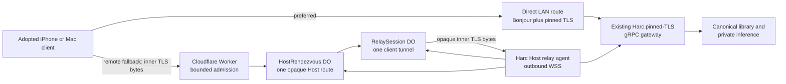
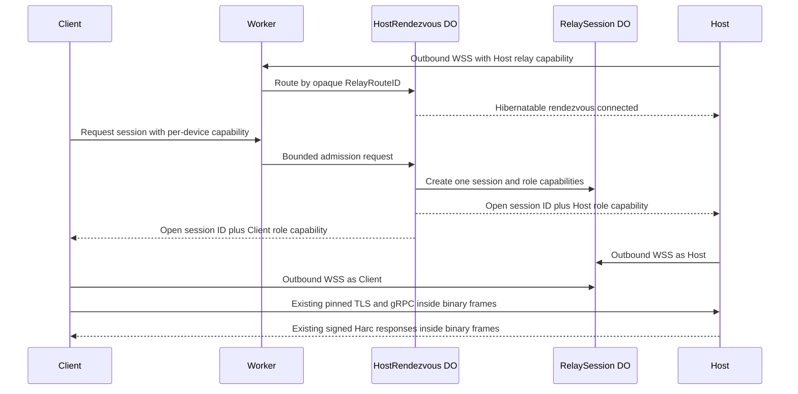

# Harc Remote Relay Architecture

The Swift outer-tunnel implementation lives in the neutral
`HarcRemoteTransport` target. `HarcHostTransport` and `HarcClientTransport`
both depend on it; neither transport adapter depends on its sibling.

**Status:** Opt-in production relay deployed; privacy, overload, and 1,000-Host load evidence verified

**Date:** 2026-08-08

**Normative specification:** [Harc Remote relay specification](../specs/2026-08-08-harc-remote-relay-spec.md)

**Delivery plan:** [Harc Remote relay buildout](../plans/2026-08-08-harc-remote-relay-buildout.md)

## Decision

Harc Remote uses a Cloudflare Worker plus hibernatable Durable Objects as an
integrated blind relay. Every customer retains one canonical Host and may adopt
N iPhone or Mac clients. The relay solves reachability only; all recording,
library, identity, authorization, processing, and speaker-identity authority
remain on Harc devices, with the Host authoritative. Application bytes are
encrypted by the existing Harc TLS session before entering Cloudflare and are
decrypted only inside the paired Harc apps.

Worker version `6aee297a-49ea-4f92-8dab-3bdad4037976` is deployed at 100% on
`https://relay.adaptcontext.com`. A script-settings read-back on 2026-08-09 at
15:12 UTC returned Logpush disabled, no Tail Workers, and no observability
configuration; `/health` remained HTTP 200 after the settings-only privacy
change. Authenticated Observability queries at 15:18 UTC returned zero Worker
events and zero traces for the relay over the preceding hour, after the
documented ingestion-delay window. Harc Remote remains opt-in and direct LAN
remains the preferred route.
Relay-level reconnect and revocation pass in real staging. Two-network physical
device behavior, direct-LAN recovery, and visible app state remain operational
evidence items.

The distinct staging Worker is deployed at
`harc-remote-relay-staging.jlworker.workers.dev`. Real Cloudflare overload and
post-redeployment checks passed on 2026-08-09, including bilateral
`4429 receiver_overloaded` closure and a no-persistent-observability read-back.
Delayed dashboard queries returned zero retained staging Worker events/traces.
Raw Cloudflare real-time tails are prohibited: the staging audit proved they
include request headers and network metadata. A purpose-built aggregate-only
observer subsequently passed the named complete-flow redaction exercise: it
discarded 261 header fields, 28 secret-header occurrences, six named canaries,
and 11 Cloudflare metadata objects across 85 events while persisting only fixed
counters and no logs, exceptions, diagnostics, or raw values. It was detached
and deleted before staging was restored to version
`6d537995-70ea-40d0-aed7-4442d93a0efa`; privacy, health, and overload checks
then passed again.

A bounded staging run opened 1,000/1,000 simultaneous idle Host rendezvous
connections with zero retries, held all connections for 30 seconds, and moved a
16-MiB opaque transfer through the production one-frame-credit protocol at
2.91 MiB/s. Health stayed OK, no Cloudflare resource/application errors were
reported, and the measured counters fit the current Workers Paid monthly
allowances. See the
[staging load and cost evidence](../evidence/2026-08-09-harc-remote-staging-load.md).
The real pinned TLS 1.3 bootstrap, authenticated Library RPC, interrupted-upload
reconciliation, and resumed upload also passed through the deployed staging
Worker. The repeatable wrapper refuses production and brackets the flow with
deployed-privacy read-backs.

A separate real-staging lifecycle harness also passed Host-offline admission,
same-route Host-control reconnect, a fresh replacement session, bidirectional
acknowledged binary relay, device-route revocation, stale-capability rejection,
and replacement authorization. This closes the relay-level lifecycle gate, not
the distinct two-unrelated-network physical-device gate.

## Connection sequence

The production control messages are fixed-schema binary or bounded JSON with
unknown fields rejected. Content messages are binary-only and are never parsed
by the relay.

## Swift integration seam

The existing gRPC and pinned-TLS stack remains unchanged. A new relay bridge
provides a loopback byte-stream endpoint:

- the client gRPC channel connects to the loopback endpoint as if it were the
  Host socket;
- the bridge packages the resulting inner TLS bytes into outer WebSocket binary
  messages; and
- the Host bridge connects the other side to its loopback Harc gateway.

This avoids a second application protocol, keeps certificate pinning at the
existing boundary, and makes direct and relay routes interchangeable below
gRPC. Route selection is `direct LAN -> relay -> durable outbox`, never a cloud
HTTP rewrite of Harc RPCs.

## Scale and cost shape

One idle rendezvous object per online Host and one short-lived session object per
active client connection create natural isolation. Hibernation prevents an idle
WebSocket from holding billed compute. Audio transfer produces message charges
and short active durations, but no object-storage or inference bill.

The design scales by adding independent Host and session object identities; no
global room, connection registry, or central database is on the payload path.
Initial quotas cap abuse while measurements establish a sustainable per-Host
remote-service price.

At the qualified 1,000-idle-Host point, hibernatable WebSockets kept displayed
Durable Object duration to 75.17 GB-s across the surrounding test window and
the run remained within current plan allowances. This validates the topology
and an owner-scale opt-in launch, not unlimited commercial pricing. Aggregate
monthly usage, unexpected disconnect rate, and stored staging test state still
need normal operational monitoring.

## Failure behavior

- Cloudflare unavailable: direct LAN continues; remote clients queue locally.
- Host asleep/offline: clients queue locally; the relay never impersonates it.
- Tunnel interrupted: existing chunk reconciliation resumes on a new tunnel.
- Capability revoked: relay admission fails and the Harc grant also fails.
- Relay compromised: content remains protected by inner TLS and Harc signatures;
  availability and traffic metadata may be affected.
- Host lost: V1 recovery still requires the base specification's explicit Host
  migration flow; the relay does not create another canonical Host.
