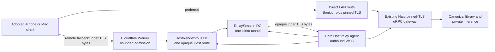
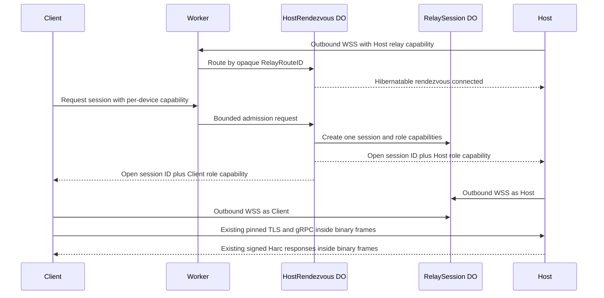

# Harc Remote Relay Architecture

The Swift outer-tunnel implementation lives in the neutral
`HarcRemoteTransport` target. `HarcHostTransport` and `HarcClientTransport`
both depend on it; neither transport adapter depends on its sibling.

**Status:** Private-beta relay deployed; production privacy/redeployment gates open

**Date:** 2026-08-08

**Normative specification:** [Harc Remote relay specification](../specs/2026-08-08-harc-remote-relay-spec.md)

**Delivery plan:** [Harc Remote relay buildout](../plans/2026-08-08-harc-remote-relay-buildout.md)

## Decision

Harc Remote uses a Cloudflare Worker plus hibernatable Durable Objects as an
integrated blind relay. Every customer retains one canonical Host and may adopt
N iPhone or Mac clients. The relay solves reachability only; all recording,
library, identity, authorization, processing, and speaker-identity authority
remain on Harc devices, with the Host authoritative. Application bytes are
encrypted by the existing Harc TLS session before entering Cloudflare and are
decrypted only inside the paired Harc apps.

The private-beta Worker is deployed at `https://relay.adaptcontext.com`. The
reviewed target production configuration disables persistent Workers Logs and
Traces, but the deployed Worker predates that change and must not be treated as
production evidence until redeployed and verified. Harc Remote remains opt-in
and direct LAN remains the preferred route.

## Connection sequence

The production control messages are fixed-schema binary or bounded JSON with
unknown fields rejected. Content messages are binary-only and are never parsed
by the relay.

## Swift integration seam

The existing gRPC and pinned-TLS stack remains unchanged. A new relay bridge
provides a loopback byte-stream endpoint:

- the client gRPC channel connects to the loopback endpoint as if it were the
  Host socket;
- the bridge packages the resulting inner TLS bytes into outer WebSocket binary
  messages; and
- the Host bridge connects the other side to its loopback Harc gateway.

This avoids a second application protocol, keeps certificate pinning at the
existing boundary, and makes direct and relay routes interchangeable below
gRPC. Route selection is `direct LAN -> relay -> durable outbox`, never a cloud
HTTP rewrite of Harc RPCs.

## Scale and cost shape

One idle rendezvous object per online Host and one short-lived session object per
active client connection create natural isolation. Hibernation prevents an idle
WebSocket from holding billed compute. Audio transfer produces message charges
and short active durations, but no object-storage or inference bill.

The design scales by adding independent Host and session object identities; no
global room, connection registry, or central database is on the payload path.
Initial quotas cap abuse while measurements establish a sustainable per-Host
remote-service price.

## Failure behavior

- Cloudflare unavailable: direct LAN continues; remote clients queue locally.
- Host asleep/offline: clients queue locally; the relay never impersonates it.
- Tunnel interrupted: existing chunk reconciliation resumes on a new tunnel.
- Capability revoked: relay admission fails and the Harc grant also fails.
- Relay compromised: content remains protected by inner TLS and Harc signatures;
  availability and traffic metadata may be affected.
- Host lost: V1 recovery still requires the base specification's explicit Host
  migration flow; the relay does not create another canonical Host.
