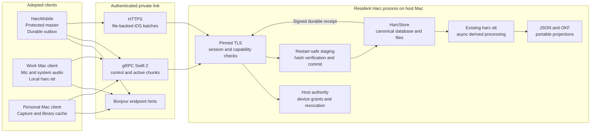
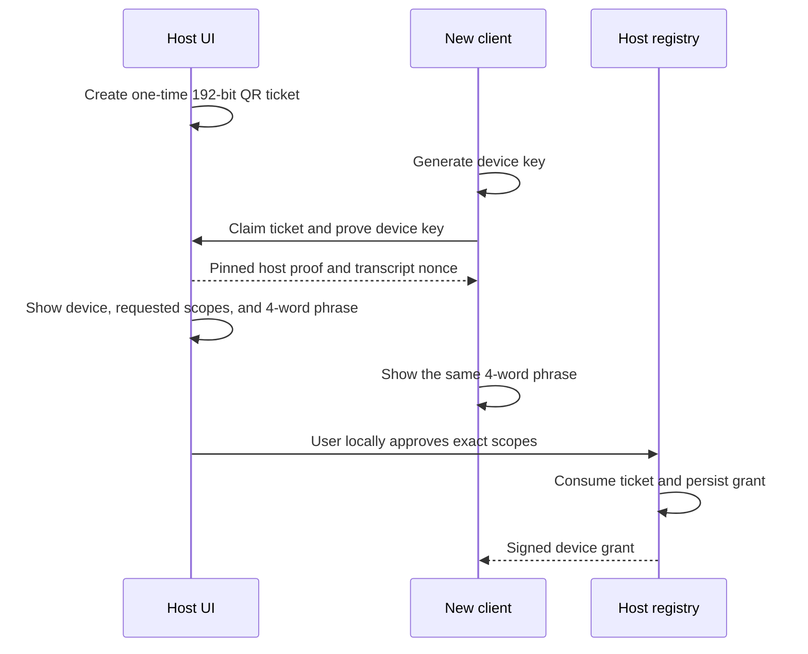
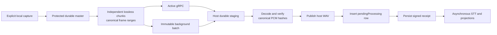

# Harc Host, Client, and Mobile Architecture

**Status:** Approved

**Date:** 2026-08-02

**Normative specification:** [Implementation specification](../specs/2026-08-02-host-client-mobile-implementation-spec.md)

**Delivery plan:** [Host/client/mobile buildout](../plans/2026-08-02-host-client-mobile-buildout.md)

## Decision

Harc remains one repository and gains three runtime roles:

- **Standalone Mac:** today's local capture, processing, and library behavior.
- **Host Mac:** the one computer that owns the canonical Harc library and adopts
  clients.
- **Adopted client:** HarcMobile or a secondary Mac that records locally,
  operates offline, and synchronizes with its chosen host.

The host can be a Mac mini, Studio, iMac, or laptop. A Mac mini is a convenient
always-on appliance, not an identity or protocol requirement. Host identity is
independent of computer name, Bonjour name, IP address, and TLS leaf key.

Clients are edge-capable. A work Mac should continue to transcribe locally for
latency, offline use, and model-cache reuse while it uploads lossless audio. An
iPhone begins host-first for speech processing but remains a complete local
recorder when no host is reachable.

## Product rules

- Harc uses no cloud STT, third-party audio processing, or external telemetry.
- The explicitly adopted, authenticated Harc host is the only automatic
  Harc-managed synchronization or processing destination. A foreground
  user-directed export may use another destination only after Harc discloses
  that it is outside the adopted-host trust boundary.
- Recording never depends on a network, host, codec, or inference model.
- A client retains its last durable audio copy until it stores a verified signed
  host receipt.
- The host is the only writer of its canonical library.
- `Harc.db` is authoritative coordinated state; WAV, structured JSON, and OKF
  Markdown are portable user-owned artifacts/projections.
- OKF remains a format at rest. It is not the upload or command protocol.
- Failed or missing audio and processing ranges stay visible and recoverable.

## System view



Bonjour supplies untrusted connection hints only. Trust comes from the authority
key learned through the pairing QR, an anti-rollback signed transport set from
that authority to the host's current TLS key, and proof of the adopted device
key on connection.

Each self-signed TLS leaf embeds the current authority-signed transport set in a
noncritical private extension. A client that missed prepublication can therefore
verify a higher-epoch set with its pinned authority during the trust challenge
before accepting the new leaf or any application data.

## Runtime ownership

### Standalone Mac

The current app remains the default. Existing capture, the `harc-stt` daemon,
`RecordingStore`, search, and projections continue on one machine without
networking.

### Host Mac

V1 embeds the host server in the current resident `LSUIElement` menu-bar process.
Closing windows leaves hosting active; choosing Quit Harc or sleeping the Mac
makes it honestly offline. `SMAppService.mainApp` remains the launch-at-login
mechanism.

There is exactly one `RecordingStore`, host-state store, OKF projection path,
and processing scheduler. A separate per-user agent is deferred. If it is ever
introduced, it becomes the sole canonical writer and the UI talks to it through
authenticated local IPC; app and agent never write concurrently.

In Host mode, the bundled `harc-mcp` also routes reads and mutations through an
authenticated same-UID local adapter in that resident process. It never falls
back to direct `Harc.db` writes when the host is unavailable. Standalone mode
keeps today's direct-store compatibility until that path is separately retired.

### Mac client

The client keeps current mic and ScreenCaptureKit capture plus local `harc-stt`.
It owns an outbox and optional cache, never the host database. Lossless upload
and local processing happen concurrently. Signed provenance lets the host decide
whether to accept compatible complete results or reprocess them.

If the Mac already has a local library, Client mode preserves it as a distinct
**On This Mac** source with its own `LibraryID`. Host cache and new Client-mode
captures remain separate; no implicit merge, move, or bulk upload occurs.

### HarcMobile

The phone owns protected uncommitted masters, discontinuities, an upload outbox,
receipts, and a scoped library cache. Its first inference path is the host. It
still supports local capture, recovery, playback, and an explicit
destination-disclosed user export without pairing.

## Identity and adoption

Harc uses a Buzz-style key-per-device identity model without adopting Nostr as
its wire protocol:

```text
Library
└── Host authority
    ├── iPhone device key and grant
    ├── Work Mac device key and grant
    └── Personal Mac device key and grant
```

- The library has a stable random `LibraryID`.
- The host has a persistent P-256 authority key in Keychain.
- Its TLS key is separate and rotatable through an authority-signed transport
  set with a monotonic epoch.
- Every installation generates its own non-synchronizing P-256 device key.
- The host registry, not a self-contained grant alone, is authoritative.
- Scopes are least privilege and individually revocable.

Pairing is locally initiated and expires after two minutes:



Ticket possession never grants access. The host user must confirm the device,
scope request, and matching phrase. V1 omits manual pairing; a future fallback
requires a separately reviewed high-entropy or PAKE design. Scope elevation,
revocation, and host migration remain local control-plane operations. Initial
library-wide scopes and every later elevation require local OS authentication.

## Transport split

- **gRPC Swift 2** on a dedicated HTTP/2 TLS listener handles capability
  negotiation, pairing, sessions, active
  chunk streaming, reconciliation, receipts, status, library reads, delta sync,
  mutations, and edge-processing artifacts.
- **Background HTTPS** on a separate narrow HTTP/1.1 TLS listener accepts only
  immutable file-backed audio batches when iOS suspends or terminates the app
  process. Both listeners use the same rotatable TLS SPKI.
- Both adapters invoke the same transport-independent host authorization and
  ingest services.
- Compressed audio does not receive another gRPC compression layer.
- Local-network transport uses the Apple TransportServices gRPC adapter.

V1 deliberately does not depend on background mTLS. Active connections use
pinned TLS plus device challenge-response. Background uploads use the same
pinned host plus narrow, high-entropy, expiring capabilities bound to one device,
grant epoch, upload, method, path, byte ceiling, and exact chunk hashes.

The host persists and rebinds its upload port while capabilities are live, and
minted URLs use the DNS-SD `.local` target rather than an IP literal. Exceptional
hostname/port changes attempt bounded recovery from a background completion
event by rediscovering the same pinned authority and rescheduling the exact
immutable body/capability. If iOS does not grant enough time, the queue waits for
the next system opportunity or foreground launch. TLS identity never derives
from that hostname or port.

## Recording and commit flow



A chunk ACK means one exact chunk is durable in staging. A recording receipt
means the complete canonical audio and `pendingProcessing` row are durable and
idempotently recoverable. Processing status is separate. Therefore speech,
diarization, summary, or projection failure cannot delay the safety receipt.

The transfer unit is a canonical PCM frame range, normally 60 seconds, encoded
as an independently decodable lossless container. Both encoded bytes and decoded
Int16 little-endian PCM are hashed. CAF+ALAC versus FLAC is selected by a measured
physical-device spike.

## Edge processing and cache policy

Desktop client artifacts include audio hash, producing device, exact engine and
model revisions, timing schema, covered frames, and failed/degraded ranges. A
signature proves origin and integrity, not remote attestation. The host may skip
duplicate work only under a local compatibility policy and otherwise reprocesses
without blocking audio ingest.

Client library data uses public UUIDs, revisions, a host-monotonic change cursor,
tombstones, and compare-and-swap mutations. It never mirrors `HarcStore` or sees
host paths. Audio-read authorization is server-enforced; post-download retention
is an explicit client policy, especially for managed work devices.

## Repository boundaries

```text
Harc/
├── HarcApp/                     Existing macOS app
├── HarcMobileApp/               Native iOS app
├── HarcMobileSpikes/            Temporary non-shipping device harness
├── Protos/                      Source and generated HarcProtocolWire target
├── Sources/
│   ├── HarcDomain/              Stable IDs, revisions, states
│   ├── HarcIdentity/            Keys, grants, signatures
│   ├── HarcTransfer/            Chunks, manifests, receipts, state machines
│   ├── HarcProtocol/            Validation, conversions, compatibility policy
│   ├── HarcHost/                Transport-independent host services
│   ├── HarcHostTransport/       gRPC, HTTPS, Bonjour, local MCP IPC adapters
│   ├── HarcClientTransport/     gRPC, HTTPS, discovery client adapters
│   ├── HarcRemoteTransport/     Shared blind-relay outer tunnel adapters
│   ├── HarcClientStore/         Cache, cursor, outboxes, conflicts
│   ├── HarcAudioMobile/         iOS capture and protected master
│   ├── HarcAudioMac/            Deferred tested extraction
│   └── HarcInference/           Deferred reusable inference extraction
└── docs/
    ├── architecture/
    ├── plans/
    └── specs/
```

Existing `HarcAudio`, `HarcClient`, `HarcCore`, `HarcStore`, and `HarcSTT`
remain authoritative until focused vertical slices move behavior. Placeholder
directories do not become targets merely for symmetry.

## Connectivity modes

1. **Standalone:** no host connection.
2. **Local private:** Bonjour discovery and direct authenticated LAN transport;
   this is the first release path.
3. **User-managed private network:** a previously paired client may later use a
   verified Tailscale or VPN endpoint. Bonjour is not used remotely.

There is no Harc-operated account service, relay, public-port onboarding, or
cloud processor in base V1. The optional blind reachability relay is governed by
the separately approved [Harc Remote relay architecture](harc-remote-relay.md)
and specification; it does not move processing or canonical data into the cloud.

## Deliberately deferred decisions

- Transparent host-authority migration; V1 copies data, creates a new authority,
  disables the old host, and re-pairs clients.
- A host agent that survives Quit Harc.
- Shared-worker processing of other devices' recordings.
- In-process mobile inference as a release dependency.
- Lossy transfer modes.
- Multiple canonical hosts or replicated writes.

The normative security, state-machine, schema, platform, test, and PR contracts
are in the linked implementation specification.
