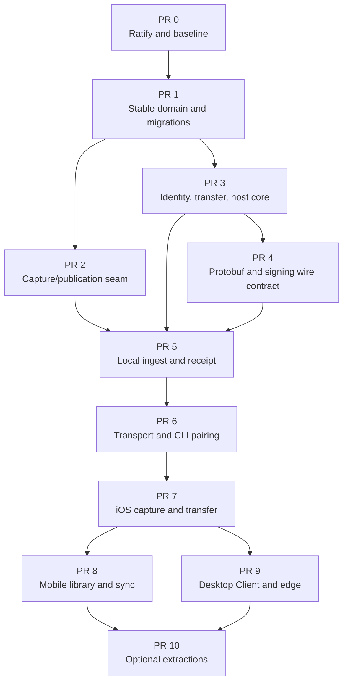

# Harc Host, Client, and Mobile Buildout

**Status:** Approved for implementation

**Date:** 2026-08-02

**Architecture:** [Host/client architecture](../architecture/host-client-architecture.md)

**Normative specification:** [Implementation specification](../specs/2026-08-02-host-client-mobile-implementation-spec.md)

**Recorded baseline:** [Pre-host/client baseline](baselines/2026-08-02-pre-host-client.md)

## Objective

Build HarcMobile and secondary-Mac Client mode in the existing Harc repository.
Every client records safely and works offline; an explicitly adopted host Mac
owns the canonical library, accepts losslessly compressed audio, returns a
signed durable receipt, and processes recordings privately.

The first TestFlight slice is complete when a new iPhone can pair by QR with a
locally approved host, record through lock, survive an unavailable host, resume
an interrupted upload without duplication, persist a signed receipt, and see
processing status. The existing standalone Mac app must remain releasable after
every pull request.

## Non-negotiable gates

- No network or processing state gates local recording.
- No client deletes its final durable audio copy before a verified host receipt.
- No cloud STT, third-party audio processing, or external telemetry is added.
- Only the resident Host-mode Harc process writes canonical host state in V1.
- Remote ingest is idempotent by stable origin identity and canonical PCM hash,
  not by a filesystem path.
- Receipt follows durable canonical audio and a pending database row; it does
  not wait for STT or OKF generation.
- iOS background transfer and capture are validated on physical devices.
- Security contracts land before exposed network endpoints.
- Schema changes include fresh-install, upgrade, preservation, uniqueness, and
  idempotent-rerun tests.
- Existing modules move only through behavior-preserving, tested seams.

## Delivery model

Use small vertical pull requests in one repository. New directories remain
documentation-only until a slice has implementation and focused tests. Do not
begin with a multiplatform rewrite of `HarcAudio`, `HarcClient`, `HarcStore`, or
`HarcSTT`. Keep the existing daemon and capture path working while adding
portable domain contracts beside them.



## PR 0 — Ratify constraints and make the baseline green

### Scope

- Land the architecture, normative spec, this plan, module READMEs, and dated
  baseline.
- Update contributor and security language to distinguish forbidden cloud/
  third-party processing from an approved user-owned host.
- Fix the deterministic `HarcVersion.fallbackVersion` drift against
  `MARKETING_VERSION`.
- Re-run the complete clean baseline and record exact evidence.

### Exit gate

- `xcodegen generate`, full `swift test`, and the unsigned macOS Xcode build are
  green from a clean checkout.
- No placeholder module is compiled.
- No product behavior changes beyond correcting version fallback drift.

## PR 1 — Stable domain identity, revision, and change log

### Scope

- Activate `HarcDomain` with stable public IDs, origin IDs, revisions,
  processing/projection state, discontinuities, cursors, and typed conflicts.
- Migrate `Harc.db` with one stable `LibraryID`; backfill every legacy row with
  a random canonical UUID and revision one; add origin mapping, PCM hash,
  processing state, writer mode, and library change log/tombstones.
- Retain existing path-based standalone ingestion as a compatibility path.
- Define network-safe recording views that contain no host-local path.

### Exit gate

- Legacy databases upgrade without losing records or paths.
- Reapplying a migration is safe.
- Duplicate origin IDs cannot create duplicate rows.
- Revisions and change cursors advance transactionally with store mutations.
- A populated v15 upgrade produces a complete anchored, path-free initial
  client snapshot even when its new change log begins empty.
- Standalone Mac tests and app build remain green.

## PR 2 — Separate capture from canonical publication

### Scope

- Make capture completion produce a `CapturedRecording` with a local master,
  timing, optional processing artifacts, warnings, and discontinuities.
- Introduce a `RecordingCommitter` seam.
- Implement `StandaloneRecordingCommitter` to reproduce today's move, store,
  JSON/Markdown, and application side effects.
- Reserve `ClientOutboxRecordingCommitter` for later without networking yet.

### Exit gate

- Current mic/system-audio capture and transcription behavior is unchanged.
- Stop, failure, and recovery tests prove capture no longer assumes every
  recording immediately belongs to the local canonical library.
- Existing application regression gates remain green.

## PR 3 — Identity, transfer, client store, and host core without sockets

### Scope

- Activate `HarcIdentity`, `HarcTransfer`, `HarcClientStore`, and
  transport-independent `HarcHost`.
- Add Keychain abstractions, P-256 identity/signature primitives, grants, epochs,
  revocation, and independent crypto vectors; exact wire envelopes land in PR 4.
- Add upload/chunk/outbox domain state machines.
- Add `HarcHost.db` for devices, pairing tickets, operations, upload journal,
  manifests, and receipts.
- Implement host authorization, staging, quotas, idempotency, and local
  application-service interfaces.
- Add a non-shipping signed iOS 18 `HarcMobileSpikes` target, run the CAF+ALAC
  versus FLAC physical-device matrix, and freeze the release codec/container.

### Exit gate

- In-process tests issue/revoke grants, stage/reconcile chunks, reject replay or
  tampering, survive store reopen, and enforce scopes without a socket.
- Key loss and device replacement require re-pairing.
- Host and client migrations pass fresh/upgrade/idempotent gates.
- Incomplete remote uploads remain a distinct recovery source.
- The selected codec is bit-exact and meets the spec's time, memory, queue, and
  thermal thresholds before PR 5 begins.

## PR 4 — Protobuf, signing, and compatibility contract

### Scope

- Add the seven versioned `.proto` files named in the implementation spec.
- Use gRPC Swift 2, SwiftProtobuf integration, and deterministic code generation.
- Separate generated `HarcProtocolWire` from validated domain conversions in
  `HarcProtocol`.
- Implement the exact signed-envelope registry, ticket/transport binary
  encodings, host-info, pairing, session, transfer, library, migration, and
  processing service APIs without binding them to NIO.
- Add current/old-minor fixtures and major-version failure behavior.

### Exit gate

- Clean checkout generation works without hand-edited output.
- Golden signing and QR/transport fixtures remain byte-identical.
- Additive unknown optional fields preserve the exact signed payload.
- Unsupported major and critical capability errors are stable and actionable.
- DTOs expose no GRDB record or filesystem path.

## PR 5 — Canonical ingest and signed durable receipt

### Scope

- Verify complete frame coverage, encoded hashes, decoded PCM hashes, quotas,
  and the selected codec's bounds through an injected decoder interface. Raw PCM
  remains fixture-only.
- Assemble, synchronize, and atomically publish the host canonical WAV.
- Idempotently insert a `pendingProcessing` row and change-log event.
- Persist exact signed manifest and `RecordingReceiptV1` bytes through the PR 4
  wire/envelope contract.
- Schedule the current `harc-stt` daemon only after receipt durability.
- Regenerate JSON and OKF through ordinary store-mediated processing.

### Exit gate

- Source and host canonical PCM hashes match.
- Kill/restart tests cover every ingest journal boundary.
- Lost receipt responses reconcile to identical bytes.
- Duplicates never create a second recording or file.
- Processing failure leaves committed playable audio and visible status.

## PR 6 — Host/client transport, discovery, and CLI pairing

### Scope

- Activate `HarcHostTransport` and `HarcClientTransport`.
- Embed the gRPC Swift 2 TransportServices server in the resident Mac app.
- Add the separate, narrow SwiftNIO/TransportServices HTTP/1.1 TLS listener for
  background batch `PUT`; use the same TLS SPKI as gRPC and no shared router.
- Persist/rebind the upload port, use the DNS-SD `.local` target rather than an
  IP literal, and implement bounded completion-event rediscovery/rescheduling
  with safe queued/foreground fallback for the exceptional route-change path.
- Add pinned TLS bindings, device challenge-response sessions, stream
  revocation, and narrow background-upload capabilities.
- Embed the exact authority-signed transport set in the private noncritical leaf
  extension so offline clients can authenticate a higher-epoch leaf during the
  trust challenge before application data.
- Add the idempotent HTTPS batch endpoint over the same ingest core.
- Advertise/discover `_harc._tcp` using Network.framework.
- Add Mac local-network purpose and Bonjour declarations.
- Add local host controls and a CLI client for pairing and fixture upload.
- Route bundled `harc-mcp` through same-UID, code-signing-validated local IPC in
  Host mode; reject direct-database fallback when the resident host is absent.
- Reuse `HarcMobileSpikes` for physical background TLS, transfer delayed beyond
  two hours across host restart/DHCP change, forced route change, correctly
  ordered authorized leaf cutover, and gRPC TransportServices
  feasibility, then fold/remove it in PR 7.

### Exit gate

- CLI discovers, pairs with local approval, reconnects, uploads a fixture,
  receives a receipt, and reads processing state.
- Tickets expire and are single-use; matching phrases and scope approval are
  required.
- Revocation terminates active access within five seconds.
- A fake Bonjour service, TLS mismatch, replay, expired capability, and
  over-limit body are rejected.
- The host never emits upload redirects; an unexpected background final URL is
  a post-transfer security failure, not a claimed preflight prevention.
- In Host mode, MCP reads/mutations succeed only through the resident process;
  killing it produces an explicit failure and no direct write.
- Closing all Mac windows leaves the server reachable; Quit and sleep appear
  offline and clients queue.

## PR 7 — HarcMobile capture, protection, outbox, and transfer

### Scope

- Add the iOS 18 SwiftUI app and test targets to `project.yml`.
- Set `TARGETED_DEVICE_FAMILY = 1`; iPad support remains deferred.
- Add accurate microphone, camera, local-network, Bonjour, background-audio,
  data-protection, privacy-manifest, and entitlement configuration.
- Implement one capture coordinator, hardware-format conversion, protected
  durable master, checkpoint repair, interruptions/routes, discontinuities, and
  a persistent recording indicator/Stop control.
- Split class-C transfer/task state from the class-A library cache and exclude
  masters, derivatives, both databases/sidecars, and cached content from backup;
  verify attributes after rename and relaunch.
- Pair by QR and show host/device trust state.
- Integrate the lossless codec selected in PR 3.
- Implement immutable chunks, background batches, persistent outbox, active
  gRPC, background URLSession, reconciliation, receipt retention, and failures.
- Keep local recovery, playback, and foreground user-directed export available
  without a host; disclose that a non-host export destination is outside the
  adopted-host trust boundary.

### Exit gate

- Simulator build is green.
- Physical-device C1, C2, T1, and T2 scenarios from the spec pass three times on
  both oldest and current test iPhones.
- Lock, airplane mode, host loss, system termination, force-quit, route change,
  and storage exhaustion cannot silently lose or duplicate audio.
- A verified receipt is the only event that enables master-retention cleanup.

This PR completes the local-network **internal** TestFlight alpha. External
TestFlight waits for reviewer-accessible demo/privacy/review readiness.

## PR 8 — Mobile library cache and delta sync

### Scope

- Add recent recordings, search, detail, playback, transcript, discontinuity,
  processing, projection, and transfer status.
- Persist permitted metadata/transcript/OKF cache, changes, tombstones, and
  latest cursor in `HarcClientStore`.
- Keep cache content in the complete-protection physical store and preserve the
  normative backup exclusion for its database, sidecars, and downloaded files.
- Add title/tag/speaker/note mutations with expected revisions and explicit
  conflict UI.
- Add cache retention and cellular/expensive-network controls.

### Exit gate

- Missed changes, compaction/full resync, deletion, revocation, and offline
  conflicts preserve outbox and user-owned uncommitted recordings.
- Client cache never becomes a canonical writer or mirrors host schema.
- Store-mediated host mutations regenerate portable projections.

## PR 9 — Secondary-Mac Client mode and edge artifacts

### Scope

- Add Standalone, Host, and Client roles to Mac settings.
- Preserve any populated pre-client library as a distinct **On This Mac** source
  with its own `LibraryID`; do not merge, move, or upload it implicitly.
- Pair a secondary Mac and use the same client store/transport/outbox contracts.
- Keep current local mic/system capture and `harc-stt` processing.
- Upload lossless audio concurrently and submit signed, coverage-complete
  provenance artifacts.
- Add host compatibility/reprocessing policy and managed-device cache controls.

### Exit gate

- The client shows a local transcript without a host round trip.
- Compatible complete work can be accepted; mismatch/degradation visibly
  reprocesses without blocking receipt.
- A managed work Mac can prohibit other-device audio retention and shared work.
- Offline mutations conflict safely rather than silently overwriting.
- Role switching explains the separate local/host sources and preserves both.

## PR 10 — Deferred extractions and lifecycle upgrades

Consider these independently after measured need:

- reusable in-process `HarcInference` while retaining `harc-stt` as a wrapper;
- tested shared audio writer primitives and `HarcAudioMac` extraction;
- supported on-device mobile inference;
- a sole-writer `SMAppService.agent` if hosting must survive Quit Harc;
- user-managed Tailscale/VPN reachability;
- adaptive iPad UI; and
- transparent host migration or a Harc-operated relay only under new specs.

None is required for the internal TestFlight alpha, and none may destabilize the
existing Mac path merely to make the module tree symmetrical.

## Validation commands

Every PR runs from generated project state:

```bash
xcodegen generate
swift test
xcodebuild \
  -project Harc.xcodeproj \
  -scheme Harc \
  -configuration Debug \
  -destination 'platform=macOS' \
  CODE_SIGNING_ALLOWED=NO \
  build
```

After PR 7:

```bash
xcodebuild \
  -project Harc.xcodeproj \
  -scheme HarcMobile \
  -configuration Debug \
  -destination 'generic/platform=iOS Simulator' \
  CODE_SIGNING_ALLOWED=NO \
  build
```

Focused suites are added with the targets and include `HarcDomainTests`,
`HarcIdentityTests`, `HarcTransferTests`, `HarcHostTests`,
`HarcProtocolCompatibilityTests`, `HarcClientStoreTests`, and
`HarcAudioMobileTests`. Physical-device evidence uses the stable scenario IDs in
the normative spec and is stored with date, device, OS, build, hashes, and logs.

## Planning range

- **Local-network internal TestFlight alpha (PRs 0–7):** 8–12 focused engineering weeks
  for one experienced Apple-platform engineer after successful early spikes.
- **Mobile beta, desktop Client mode, and hardening:** approximately 20–28 weeks
  total.

These are initial ranges. Each PR should be separately estimated after its
predecessor lands; observed migration, device, codec, and background-transfer
evidence replaces planning assumptions.

## Coding-agent handoff rule

Begin with PR 0, then PR 1. Do not start UI or network endpoint work early. At
the start of each PR, quote the applicable spec sections in the implementation
plan, list migrations and failure-injection tests, and name the exact standalone
Mac behavior that must remain unchanged. Stop the PR when its exit gate is met;
do not opportunistically pull later module extractions forward.
